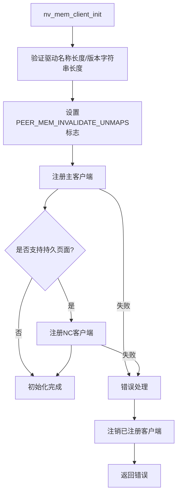
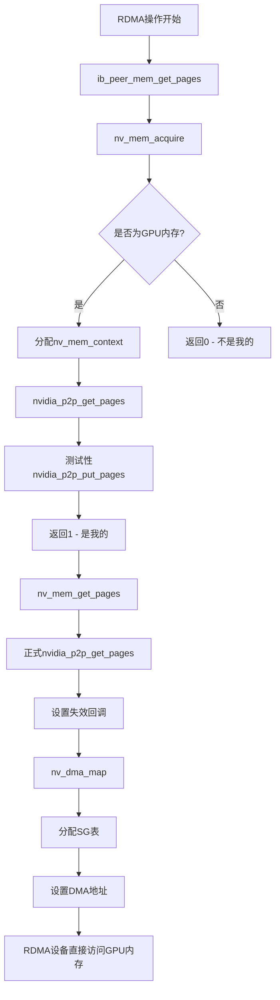
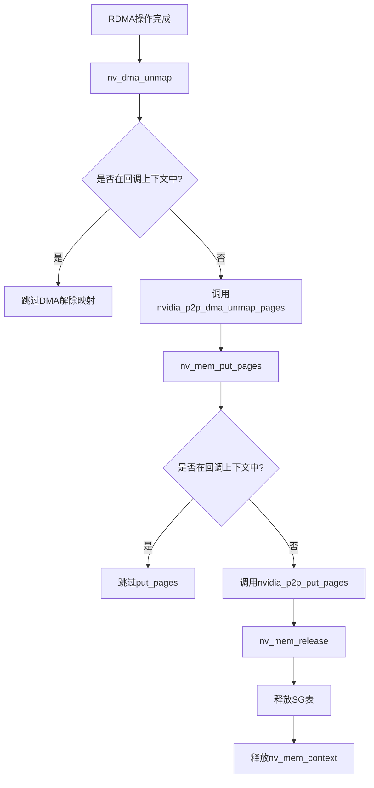
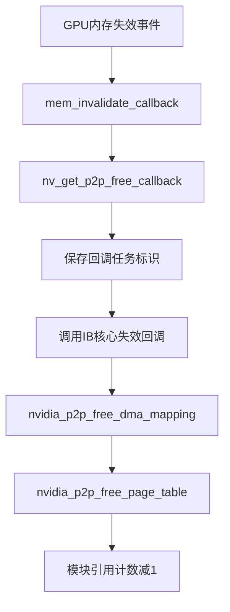
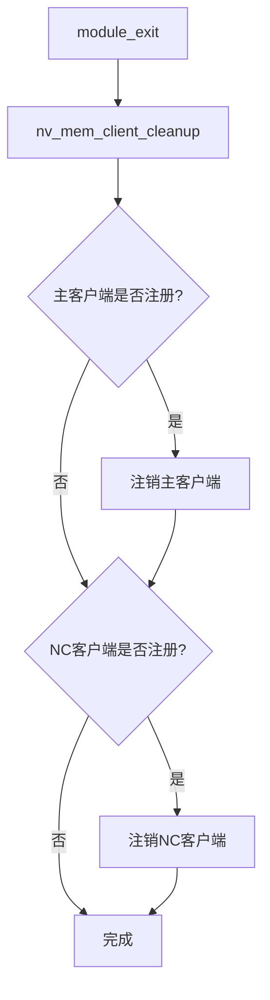
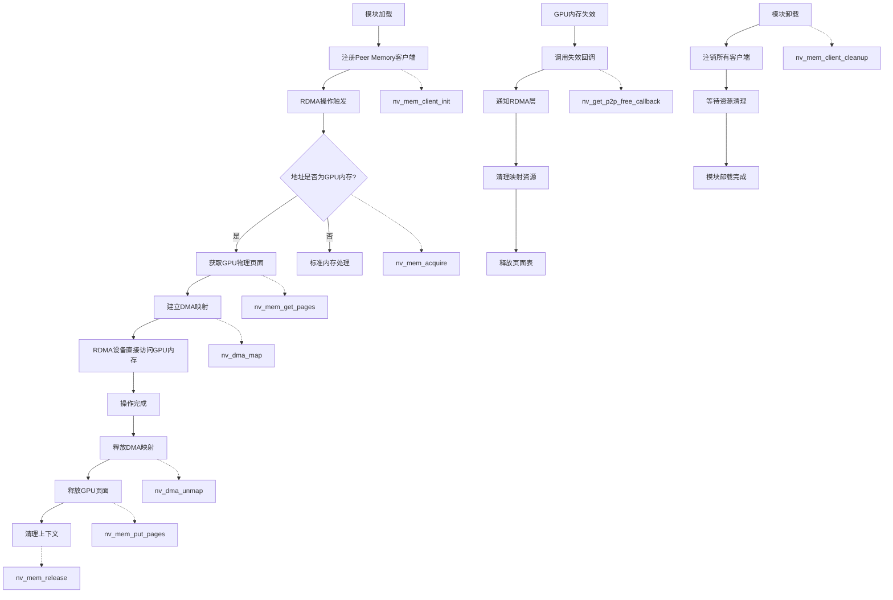

这个代码实现了 NVIDIA GPU 内存作为 RDMA peer memory 客户端的核心功能。

- 这个模块充当 RDMA peer-memory client：当上层想把一段内存（GPU 内存）注册为 RDMA 可访问时，IB/core 会调用该 client 的一系列回调（**acquire → get_pages → dma_map → DMA → unmap → put_pages → release**），该模块通过 NVIDIA 的 P2P API（nvidia_p2p_get_pages / put_pages / dma_map / free 等）把 GPU 的页面交给 IB 层并提供 DMA addresses（或直接 physical addresses），从而实现 GPU memory 的 RDMA 访问（zero-copy）。  
- 它同时处理 NVIDIA 驱动异步“页面无效化”回调：当 NVIDIA 驱动要回收页面时，它会通知此模块，模块会通知 IB core（mem_invalidate_callback），并在适当时释放或取消映射资源，且小心处理回调上下文避免竞态/双重释放。

## 核心数据结构

### 1. `struct nv_mem_context`
```c
struct nv_mem_context {
    struct nvidia_p2p_page_table *page_table;    // GPU页表，指向 nvidia_p2p_page_table（由 nvidia_p2p_get_pages 返回）
#if NV_DMA_MAPPING
    struct nvidia_p2p_dma_mapping *dma_mapping; // DMA映射信息，nvidia_p2p_dma_mapping
#endif
    u64 core_context;           // 保存 IB/core 传来的上下文（类型视宏而定）
    u64 page_virt_start;        // 按 GPU 页面对齐的起始虚拟地址
    u64 page_virt_end;          // 按 GPU 页面对齐的结束虚拟地址
    size_t mapped_size;         // 按 GPU 页面对齐的虚拟地址大小
    unsigned long npages;       // 页数量
    unsigned long page_size;    // 页大小 (64KB)
    struct task_struct *callback_task; // 当回调执行时记录 current task，用来在回调上下文区分行为（例如避免重复 unmap）
    int sg_allocated;           // SG表是否分配
    struct sg_table sg_head;    // scatter-gather表
};
```

### 2. Peer Memory 客户端结构
```c
static struct peer_memory_client_ex nv_mem_client_ex = {
    .client = {
        .acquire = nv_mem_acquire,
        .get_pages = nv_mem_get_pages,
        .dma_map = nv_dma_map,
        .dma_unmap = nv_dma_unmap,
        .put_pages = nv_mem_put_pages,
        .get_page_size = nv_mem_get_page_size,
        .release = nv_mem_release,
    },
    .flags = PEER_MEM_INVALIDATE_UNMAPS,
};
```

## 完整执行流程

### 阶段1: 模块初始化流程



**对应函数：**

`nv_mem_client_init`：

- 填充 peer_memory_client_ex 结构，设置 name/version、标志 PEER_MEM_INVALIDATE_UNMAPS（表示在 invalidate 时不需要 core 去做默认 unmap/put_pages）
- 注册主 client（ib_register_peer_memory_client），保存 reg_handle，并得到 mem_invalidate_callback（IB core 提供）
- 若支持 persistent pages，再注册 nc client（保存 reg_handle_nc）
- 若注册失败则 cleanup

```c
static int __init nv_mem_client_init(void)
{
    int status = 0;

    // 1. 验证和设置客户端信息
	// off by one, to leave space for the trailing '1' which is flagging
	// the new client type
	BUG_ON(strlen(DRV_NAME) > IB_PEER_MEMORY_NAME_MAX-1);
	strcpy(nv_mem_client_ex.client.name, DRV_NAME);

	// [VER_MAX-1]=1 <-- last byte is used as flag
	// [VER_MAX-2]=0 <-- version string terminator
	BUG_ON(strlen(DRV_VERSION) > IB_PEER_MEMORY_VER_MAX-2);
	strcpy(nv_mem_client_ex.client.version, DRV_VERSION);

    // 2. 设置新式客户端标志
	// Register as new-style client
	// Needs updated peer_mem patch, but is harmless otherwise
	nv_mem_client_ex.client.version[IB_PEER_MEMORY_VER_MAX-1] = 1;
	nv_mem_client_ex.ex_size = sizeof(struct peer_memory_client_ex);

    // 3. 设置优化标志 - 告诉IB层不需要在失效时调用unmap/put_pages
	// PEER_MEM_INVALIDATE_UNMAPS allow clients to opt out of
	// unmap/put_pages during invalidation, i.e. the client tells the
	// infiniband layer that it does not need to call
	// unmap/put_pages in the invalidation callback
	nv_mem_client_ex.flags = PEER_MEM_INVALIDATE_UNMAPS;

    // 4. 注册主客户端
	reg_handle = ib_register_peer_memory_client(&nv_mem_client_ex.client,
						    &mem_invalidate_callback);
	if (!reg_handle) {
		peer_err("nv_mem_client_init -- error while registering client\n");
		status = -EINVAL;
		goto out;
	}

    // 5. 条件注册NC客户端
	// Register the NC client only if nvidia.ko supports persistent pages
	if (nv_support_persistent_pages()) {
		strcpy(nv_mem_client_nc.name, DRV_NAME "_nc");
		strcpy(nv_mem_client_nc.version, DRV_VERSION);
		reg_handle_nc = ib_register_peer_memory_client(&nv_mem_client_nc, NULL);
		if (!reg_handle_nc) {
			peer_err("nv_mem_client_init -- error while registering nc client\n");
			status = -EINVAL;
			goto out;
		}
	}

out:
	if (status) {
		if (reg_handle) {
			ib_unregister_peer_memory_client(reg_handle);
			reg_handle = NULL;
		}

		if (reg_handle_nc) {
			ib_unregister_peer_memory_client(reg_handle_nc);
			reg_handle_nc = NULL;
		}
	}

	return status;
}
```

### 阶段2: GPU内存访问流程（RDMA操作）



**对应函数：**

#### 2.1 `nv_mem_acquire()` - 判断是否为GPU内存

- IB/core 在注册 MR 前会询问各 peer-memory client，这个函数用于判断给定 addr/size 是否属于该 client（返回 1 表示“是我的”）。
- 实现：
  - 分配 nv_mem_context，计算 page_virt_start/end、mapped_size（按 GPU 页面对齐）
  - 调用 nvidia_p2p_get_pages(..., nv_mem_dummy_callback, nv_mem_context) 来尝试获得 page_table（dummy callback 用于在 NVIDIA 发出 free 回调时简单释放 page_table）
  - 紧接着调用 nvidia_p2p_put_pages(...)（把页放回）。这里的动机是：在 acquire 阶段只是验证并初始化上下文，真正的 get_pages 之后才会再次获取页面；acquire 保证“这是 NVIDIA GPU 内存”，并把 client_context 返回给 IB/core（所以 acquire 返回 1 并把 nv_mem_context 交给 core）
  - 成功则把 client_context 返回给 IB 并做 module_get，失败则释放并返回 0（表示“不是我的”或无法处理）。acquire 应尽量轻量，只判断是否属于该 driver；真正拿页面并保持映射的工作由 get_pages/dma_map 完成。

```c
/* acquire return code: 1 mine, 0 - not mine */
static int nv_mem_acquire(unsigned long addr, size_t size, void *peer_mem_private_data,
                          char *peer_mem_name, void **client_context)
{
    int ret = 0;
    struct nv_mem_context *nv_mem_context;

    /* 为每次 acquire 分配 context (kzalloc，初始化为 0) */
    nv_mem_context = kzalloc(sizeof *nv_mem_context, GFP_KERNEL);
    if (!nv_mem_context)
        /* 分配失败就当作“不是我的”处理 */
        return 0;

    /* 以 GPU page (64KB对齐)对齐 start/end，计算 mapped_size */
    nv_mem_context->page_virt_start = addr & GPU_PAGE_MASK;
    nv_mem_context->page_virt_end   = (addr + size + GPU_PAGE_SIZE - 1) & GPU_PAGE_MASK;
    nv_mem_context->mapped_size  = nv_mem_context->page_virt_end - nv_mem_context->page_virt_start;

    /* 尝试向 NVIDIA P2P 层获取 page_table (临时获取)
       使用 nv_mem_dummy_callback：如果 NVIDIA 触发回调，dummy 回调会释放 page_table
       这里的目的是验证能否获取到 page_table（验证地址是否为 NVIDIA GPU 内存）
    */
    ret = nvidia_p2p_get_pages(0, 0, nv_mem_context->page_virt_start, nv_mem_context->mapped_size,
            &nv_mem_context->page_table, nv_mem_dummy_callback, nv_mem_context);

    if (ret < 0)
        goto err;

    /* 立即 put_pages：acquire 只做识别与临时验证，不在此阶段长期持有 page_table */
    ret = nvidia_p2p_put_pages(0, 0, nv_mem_context->page_virt_start,
                               nv_mem_context->page_table);
    if (ret < 0) {
        /* 理论上不预期失败，但若 callback 恰在 put 之前触发，put 可能失败（已与 NVIDIA 确认会 graceful fail）
         * 在失败情况下打印错误并当作失败处理
         */
        peer_err("nv_mem_acquire -- error %d while calling nvidia_p2p_put_pages()\n", ret);
        goto err;
    }

    /* 成功：把 nv_mem_context 返回给 IB core 作为 client_context，并增加模块引用计数 */
    *client_context = nv_mem_context;
    __module_get(THIS_MODULE);
    return 1;

err:
    kfree(nv_mem_context);
    /* 错误当作“不是我的” */
    return 0;
}
```

#### 2.2 `nv_mem_get_pages()` - IB/core 查询地址是否属于该 client（返回 1 = mine, 0 = not mine）

- IB/core 在需要实际映射页面给设备时调用。此处会正式调用 nvidia_p2p_get_pages，并传入 nv_get_p2p_free_callback（用于 NVIDIA 驱动通知页面无效时的回调）。
- nv_mem_get_pages：
  - 保存 core_context，设置 page_size（GPU 页面大小）
  - 调用 nvidia_p2p_get_pages(..., nv_get_p2p_free_callback, nv_mem_context)。回调会在 NVIDIA 驱动需要释放/无效化这些页时被触发。
- nv_mem_get_pages_nc：类似但用于“persistent pages”场景（NV 支持持久页），调用 get_pages 时不传入 callback（NULL），即不期望 NVIDIA 回调。这对应注册的另一个 client（nv_mem_nc）。

```c
static int nv_mem_get_pages(unsigned long addr, size_t size, int write, int force,
                          struct sg_table *sg_head, void *client_context,
                          u64 core_context)
{
    // 1. 保存核心上下文
    nv_mem_context->core_context = core_context;
    nv_mem_context->page_size = GPU_PAGE_SIZE;
    
    // 2. 正式获取GPU页面，设置真实回调函数
    ret = nvidia_p2p_get_pages(0, 0, nv_mem_context->page_virt_start, 
                              nv_mem_context->mapped_size,
                              &nv_mem_context->page_table, 
                              nv_get_p2p_free_callback, nv_mem_context);
    
    // 3. 实际的页面处理延迟到nv_dma_map中进行
    return 0;
}
```

#### 2.3 `nv_dma_map()` - 为设备构建 sg_table 与 DMA 映射

- 用于为指定设备构建 sg_table 并填充 dma_address/dma_length，使 RDMA 设备可以直接进行 DMA。
- 实现两条路径：
  - NV_DMA_MAPPING 启用时（有 nvidia_p2p_dma_map_pages）：
    - 调用 nvidia_p2p_dma_map_pages(pdev, page_table, &dma_mapping)
    - 检查 dma_mapping 版本兼容性
    - 根据 dma_mapping->entries 分配 sg_table（每 entry 对应一个 GPU page），填写 sg->dma_address = dma_mapping->dma_addresses[i]，sg->dma_length = page_size
    - 保存 dma_mapping 到 nv_mem_context，以便 unmap 时释放
  - 否则（没有 dma 映射支持）：
    - 期待 page_table->entries 与 计算得到的 npages 匹配
    - 分配 sg_table，直接从 page_table->pages[i]->physical_address 填充 sg->dma_address（直接给出物理地址）
- 记录 sg_allocated, 保存 sg_head，并返回 *nmap = npages

并发与错误：

- 若 sg_alloc_table 失败，要撤销已做的 dma mapping（在 NV_DMA_MAPPING 路径中）。
- 调用者 (IB/core) 会在后续调用 nv_dma_unmap/nv_mem_put_pages/nv_mem_release 回收资源，模块会校验传入 sg 是否与缓存的一样（memcmp）以避免参数混淆。

```c
/* nv_dma_map:
 * - sg_head: caller-supplied pointer to sg_table to populate
 * - context: nv_mem_context previously returned by acquire
 * - dma_device: struct device * for the device which will DMA (usually NIC)
 * - dmasync: unused here (synchronization flags)
 * - nmap: out param, number of mapped entries
 */
static int nv_dma_map(struct sg_table *sg_head, void *context,
                      struct device *dma_device, int dmasync,
                      int *nmap)
{
    int i, ret;
    struct scatterlist *sg;
    struct nv_mem_context *nv_mem_context =
        (struct nv_mem_context *) context;
    struct nvidia_p2p_page_table *page_table = nv_mem_context->page_table;

    /* 驱动假设 GPU page_size == NVIDIA_P2P_PAGE_SIZE_64KB */
    if (page_table->page_size != NVIDIA_P2P_PAGE_SIZE_64KB) {
        peer_err("nv_dma_map -- assumption of 64KB pages failed size_id=%u\n",
                    nv_mem_context->page_table->page_size);
        return -EINVAL;
    }

#if NV_DMA_MAPPING
    {
        /* NV DMA mapping 路径：使用 nvidia_p2p_dma_map_pages 来获取 DMA addresses */
        struct nvidia_p2p_dma_mapping *dma_mapping;
        struct pci_dev *pdev = to_pci_dev(dma_device);

        if (!pdev) {
            peer_err("nv_dma_map -- invalid pci_dev\n");
            return -EINVAL;
        }

        /* 请求 NVIDIA 驱动把 page_table 映射给 pdev（得到 dma_mapping） */
        ret = nvidia_p2p_dma_map_pages(pdev, page_table, &dma_mapping);
        if (ret) {
            peer_err("nv_dma_map -- error %d while calling nvidia_p2p_dma_map_pages()\n", ret);
            return ret;
        }

        /* 校验 dma_mapping 版本兼容性 */
        if (!NVIDIA_P2P_DMA_MAPPING_VERSION_COMPATIBLE(dma_mapping)) {
            peer_err("error, incompatible dma mapping version 0x%08x\n",
                     dma_mapping->version);
            nvidia_p2p_dma_unmap_pages(pdev, page_table, dma_mapping);
            return -EINVAL;
        }

        /* entries 是映射后的页数 */
        nv_mem_context->npages = dma_mapping->entries;

        /* 为 sg_table 分配 entries 个 scatterlist */
        ret = sg_alloc_table(sg_head, dma_mapping->entries, GFP_KERNEL);
        if (ret) {
            nvidia_p2p_dma_unmap_pages(pdev, page_table, dma_mapping);
            return ret;
        }

        nv_mem_context->dma_mapping = dma_mapping;

        /* 填充每个 sg entry：dma_address = dma_mapping->dma_addresses[i] */
        for_each_sg(sg_head->sgl, sg, nv_mem_context->npages, i) {
            sg_set_page(sg, NULL, nv_mem_context->page_size, 0);
            sg->dma_address = dma_mapping->dma_addresses[i];
            sg->dma_length = nv_mem_context->page_size;
        }
    }
#else
    /* 非 NV_DMA_MAPPING 情况：直接从 page_table->pages 获取 physical_address */
    nv_mem_context->npages = PAGE_ALIGN(nv_mem_context->mapped_size) >>
                                GPU_PAGE_SHIFT;

    if (page_table->entries != nv_mem_context->npages) {
        peer_err("nv_dma_map -- unexpected number of page table entries got=%u, expected=%lu\n",
                    page_table->entries,
                    nv_mem_context->npages);
        return -EINVAL;
    }

    ret = sg_alloc_table(sg_head, nv_mem_context->npages, GFP_KERNEL);
    if (ret)
        return ret;

    for_each_sg(sg_head->sgl, sg, nv_mem_context->npages, i) {
        sg_set_page(sg, NULL, nv_mem_context->page_size, 0);
        sg->dma_address = page_table->pages[i]->physical_address;
        sg->dma_length = nv_mem_context->page_size;
    }
#endif

    /* 标记 sg 已分配，并缓存 sg_head (复制结构) 以便后续校验 */
    nv_mem_context->sg_allocated = 1;
    nv_mem_context->sg_head = *sg_head;
    peer_dbg("allocated sg_head.sgl=%p\n", nv_mem_context->sg_head.sgl);
    *nmap = nv_mem_context->npages;

    return 0;
}
```

### 阶段3: GPU内存释放流程



**对应函数：**

#### 3.1 `nv_dma_unmap()` - DMA解除映射

- 验证传入的 sg_table 与保存的 sg_head 一致（memcmp），若不一致报错
- 如果当前在回调上下文（nv_mem_context->callback_task == current），则 no-op（避免在 NVIDIA 的回调上下文里做 unmap）；否则如果使用 dma_mapping，会调用 nvidia_p2p_dma_unmap_pages 去取消映射
- 返回成功（但注意很多地方将无效化/释放交给 nv_get_p2p_free_callback）

```c
static int nv_dma_unmap(struct sg_table *sg_head, void *context,
                       struct device *dma_device)
{
    // 1. 检查是否在回调上下文中 (避免死锁)
    if (nv_mem_context->callback_task == current) {
        peer_dbg("no-op in callback context\n");
        return 0;
    }
    
#if NV_DMA_MAPPING
    // 2. 调用NVIDIA DMA解除映射
    struct pci_dev *pdev = to_pci_dev(dma_device);
    if (nv_mem_context->dma_mapping)
        nvidia_p2p_dma_unmap_pages(pdev, nv_mem_context->page_table,
                                 nv_mem_context->dma_mapping);
#endif
    return 0;
}
```

#### 3.2 `nv_mem_put_pages()` - 释放GPU页面

- 当 IB/core 完成对该 memory 的使用后，调用 put_pages 来释放页面（调用 nvidia_p2p_put_pages）
- 同样会在回调上下文中识别并跳过实际 put（以避免在 NVIDIA 的无效化回调里重复 put）
- 在 put 完成后 page_table 可能会被 freed（或会在 nv_get_p2p_free_callback 中 freed）

```c
static void nv_mem_put_pages(struct sg_table *sg_head, void *context)
{
    // 1. 检查是否在回调上下文中
    if (nv_mem_context->callback_task == current) {
        peer_dbg("no-op in callback context\n");
        return;
    }
    
    // 2. 调用NVIDIA API释放页面
    ret = nvidia_p2p_put_pages(0, 0, nv_mem_context->page_virt_start,
                             nv_mem_context->page_table);
}
```

#### 3.3 `nv_mem_release()` - 释放上下文

释放 sg_table（若已分配）并 kfree nv_mem_context，module_put

```c
static void nv_mem_release(void *context)
{
    // 1. 释放SG表
    if (nv_mem_context->sg_allocated) {
        sg_free_table(&nv_mem_context->sg_head);
        nv_mem_context->sg_allocated = 0;
    }
    
    // 2. 释放上下文内存
    kfree(nv_mem_context);
    module_put(THIS_MODULE);
}
```

### 阶段4: GPU内存失效回调流程



**对应函数：**

#### 4.1 `nv_get_p2p_free_callback()` - NVIDIA 驱动在页面被回收/失效时调用（NVIDIA -> 本模块 -> IB core）

- NVIDIA 在页集被驱逐或失效时会调用此回调（由 nvidia_p2p_get_pages 注册）。
- 回调做的事：
  - 保存 page_table/dma_mapping 局部副本（防止 nv_mem_release 在回调过程中释放）
  - 设置 nv_mem_context->callback_task = current（标识当前是回调上下文）
  - 调用 mem_invalidate_callback(reg_handle, nv_mem_context->core_context) —— 这是 IB 层提供的回调，通知 IB core 该 memory 已经无效，IB core 会在其回调中执行必要操作（例如将 MR 标记为无效、触发撤销等）
  - 把 callback_task 清空
  - 释放 (nvidia_p2p_free_dma_mapping) 和 (nvidia_p2p_free_page_table)（释放驱动端资源）
  - 注意：在整个过程中用 module_get/module_put 来保持模块不会被卸载（引用计数）

```c
/* nv_get_p2p_free_callback(void *data)
 * Called by NVIDIA P2P layer when a page table (or mapping) must be freed/invalidated.
 * data is nv_mem_context passed when registering the callback.
 */
static void nv_get_p2p_free_callback(void *data)
{
    int ret = 0;
    struct nv_mem_context *nv_mem_context = (struct nv_mem_context *)data;
    struct nvidia_p2p_page_table *page_table = NULL;
#if NV_DMA_MAPPING
    struct nvidia_p2p_dma_mapping *dma_mapping = NULL;
#endif

    __module_get(THIS_MODULE);
    /* 增加模块引用，防止在回调处理中模块被卸载 */

    if (!nv_mem_context) {
        peer_err("nv_get_p2p_free_callback -- invalid nv_mem_context\n");
        goto out;
    }

    if (!nv_mem_context->page_table) {
        peer_err("nv_get_p2p_free_callback -- invalid page_table\n");
        goto out;
    }

    /* 保存 page_table 到局部变量，避免后续释放过程中
       nv_mem_release 等可能把结构清空导致并发问题。 */
    page_table = nv_mem_context->page_table;

#if NV_DMA_MAPPING
    if (!nv_mem_context->dma_mapping) {
        peer_err("nv_get_p2p_free_callback -- invalid dma_mapping\n");
        goto out;
    }
    dma_mapping = nv_mem_context->dma_mapping;
#endif

    /* NOTE: 注释中说明：不把 nv_mem_context->page_table 置 NULL，
       因为 NVIDIA 确认 inflight put_pages 用有效指针会安全失败。 */

    peer_dbg("calling mem_invalidate_callback\n");

    /* 标记当前回调任务，供 nv_dma_unmap / nv_mem_put_pages 检测并避免重复释放 */
    nv_mem_context->callback_task = current;

    /* 通知 IB core：该 core_context 的页集已被 NVIDIA 驱动失效。
       mem_invalidate_callback 在 module init 时由 ib_register_peer_memory_client 填充（IB 核心提供）。
       IB core 在其实现中会针对该 core_context 触发必要的无效化流程（例如回收 MR 等）。
    */
    (*mem_invalidate_callback)(reg_handle, nv_mem_context->core_context);

    /* 清除回调任务标识 */
    nv_mem_context->callback_task = NULL;

#if NV_DMA_MAPPING
    /* 若我们之前做了 DMA mapping, 现在要释放 DMA mapping */
    ret = nvidia_p2p_free_dma_mapping(dma_mapping);
    if (ret)
        peer_err("nv_get_p2p_free_callback -- error %d while calling nvidia_p2p_free_dma_mapping()\n", ret);
#endif

    /* 最后释放 nvidia page table（drivers side） */
    ret = nvidia_p2p_free_page_table(page_table);
    if (ret)
        peer_err("nv_get_p2p_free_callback -- error %d while calling nvidia_p2p_free_page_table()\n", ret);

out:
    module_put(THIS_MODULE);
    /* 释放模块引用并返回 */
    return;
}
```

### 阶段5: 模块退出流程



**对应函数：**
```c
static void __exit nv_mem_client_cleanup(void)
{
    // 1. 注销主客户端
    if (reg_handle)
        ib_unregister_peer_memory_client(reg_handle);
    
    // 2. 注销NC客户端
    if (reg_handle_nc)
        ib_unregister_peer_memory_client(reg_handle_nc);
}
```

## 关键优化点

### 1. `PEER_MEM_INVALIDATE_UNMAPS` 标志
```c
nv_mem_client_ex.flags = PEER_MEM_INVALIDATE_UNMAPS;
```
- **作用**: 告诉 IB 层在内存失效时不需要调用 `unmap/put_pages`
- **优化原理**: NVIDIA 驱动在失效回调中已经处理了资源清理，避免重复操作
- **性能提升**: 减少不必要的函数调用和锁竞争

### 2. 回调上下文检测
```c
if (nv_mem_context->callback_task == current) {
    peer_dbg("no-op in callback context\n");
    return;
}
```
- **作用**: 避免在失效回调上下文中重复调用清理函数
- **原理**: 防止死锁和重复释放资源
- **重要性**: 确保内存管理的正确性和稳定性

### 3. 双客户端设计
- **主客户端**: 支持内存失效回调，适用于通用场景
- **NC客户端 (Non-Cached)**: 无失效回调，适用于持久化页面
- **条件注册**: 仅当 NVIDIA 驱动支持持久页面时才注册 NC 客户端

### 4. 64KB 页面对齐
```c
#define GPU_PAGE_SHIFT   16
#define GPU_PAGE_SIZE    ((u64)1 << GPU_PAGE_SHIFT)
```
- **作用**: 与 NVIDIA GPU 的物理页面大小匹配
- **性能优化**: 减少页面映射开销，提高 DMA 传输效率
- **硬件要求**: A100 等现代 GPU 支持 64KB 大页面

## 整体架构流程图



## 性能关键点

1. **Zero-Copy 传输**: RDMA 设备直接访问 GPU 物理内存，无需 CPU 拷贝
2. **批量操作**: 64KB 大页面减少 TLB 压力和映射开销
3. **异步失效**: 通过回调机制处理 GPU 内存失效，避免阻塞
4. **资源复用**: NV DMA 映射 API 避免重复的物理地址转换
5. **死锁预防**: 回调上下文检测确保线程安全

这个实现是 GPUDirect RDMA 技术的核心，通过将 NVIDIA GPU 内存无缝集成到 RDMA 编程模型中，为 AI/ML 训练、HPC 计算等场景提供了极致的 GPU-GPU 通信性能。

# `peer_mem.h`

所在路径`/usr/src/linux-headers-5.15.0-25/include/rdma/peer_mem.h`

源码如下：

```c
/* SPDX-License-Identifier: GPL-2.0 OR Linux-OpenIB */
/*
 * Copyright (c) 2014-2020,  Mellanox Technologies. All rights reserved.
 */
#ifndef RDMA_PEER_MEM_H
#define RDMA_PEER_MEM_H

#include <linux/scatterlist.h>

#define IB_PEER_MEMORY_NAME_MAX 64
#define IB_PEER_MEMORY_VER_MAX 16

/*
 * Prior versions used a void * for core_context, at some point this was
 * switched to use u64. Be careful if compiling this as 32 bit. To help the
 * value of core_context is limited to u32 so it should work OK despite the
 * type change.
 */
#define PEER_MEM_U64_CORE_CONTEXT

struct device;

/**
 * struct peer_memory_client - 用户虚拟内存处理程序的注册信息
 *
 * peer_memory_client 方案允许驱动程序向 ib_umem 系统注册，表明其具备理解那些无法与 get_user_pages() 兼容的用户虚拟地址范围的能力。例如，通过 io_remap_pfn_range() 创建的 VMA（虚拟内存区域），或者其他驱动程序专用的 VMA。
 *
 * 对于该接口所理解的地址范围，它可以提供一个 DMA 映射的 sg_table（散列-聚合表），供 ib_umem 使用，从而使得那些无法通过 get_user_pages() 支持的用户虚拟地址范围也可以被用作 umem。
 */
struct peer_memory_client {
        char name[IB_PEER_MEMORY_NAME_MAX];
        char version[IB_PEER_MEMORY_VER_MAX];

        /**
         * acquire - Begin working with a user space virtual address range
         *
         * @addr - Virtual address to be checked whether belongs to peer.
         * @size - Length of the virtual memory area starting at addr.
         * @peer_mem_private_data - Obsolete, always NULL
         * @peer_mem_name - Obsolete, always NULL
         * @client_context - Returns an opaque value for this acquire use in
         *                   other APIs
         *
         * Returns 1 if the peer_memory_client supports the entire virtual
         * address range, 0 or -ERRNO otherwise.  If 1 is returned then
         * release() will be called to release the acquire().
         */
        /**
         * acquire - 开始处理用户空间虚拟地址范围
         *
         * @addr - 要检查是否属于对等方的虚拟地址。
         * @size - 从addr开始的虚拟内存区域的长度。
         * @peer_mem_private_data - 已过时，始终为NULL
         * @peer_mem_name - 已过时，始终为NULL
         * @client_context - 返回一个不透明值，用于在后续API调用中引用此次acquire操作
         *
         * 如果对等方内存客户端支持整个虚拟地址范围，则返回1；否则返回0或-ERRNO。如果返回1，则将调用release()来释放此次acquire操作。
         */
        int (*acquire)(unsigned long addr, size_t size,
                       void *peer_mem_private_data, char *peer_mem_name,
                       void **client_context);
        /**
         * get_pages - Fill in the first part of a sg_table for a virtual
         *             address range
         *
         * @addr - Virtual address to be checked whether belongs to peer.
         * @size - Length of the virtual memory area starting at addr.
         * @write - Always 1
         * @force - 1 if write is required
         * @sg_head - Obsolete, always NULL
         * @client_context - Value returned by acquire()
         * @core_context - Value to be passed to invalidate_peer_memory for
         *                 this get
         *
         * addr/size are passed as the raw virtual address range requested by
         * the user, it is not aligned to any page size. get_pages() is always
         * followed by dma_map().
         *
         * Upon return the caller can call the invalidate_callback().
         *
         * Returns 0 on success, -ERRNO on failure. After success put_pages()
         * will be called to return the pages.
         */
        /**
         * get_pages - 为虚拟地址范围填充 sg_table 的第一部分
         *
         * @addr - 要检查是否属于对等体的虚拟地址。
         * @size - 从 addr 开始的虚拟内存区域的长度。
         * @write - 始终为 1
         * @force - 如果需要写入操作，则设为 1
         * @sg_head - 已过时，始终为 NULL
         * @client_context - 由 acquire() 函数返回的值
         * @core_context - 传递给 invalidate_peer_memory 函数用于此次获取的值
         *
         * addr 和 size 是用户请求的原始虚拟地址范围，它们并未对齐到任何页大小。get_pages() 函数总是紧接着 dma_map() 函数调用。
         *
         * 调用该函数后，调用者可以调用 invalidate_callback() 函数。
         *
         * 成功时返回 0，失败时返回 -ERRNO。成功返回后，将调用 put_pages() 函数来释放这些页面。
         */
        int (*get_pages)(unsigned long addr, size_t size, int write, int force,
                         struct sg_table *sg_head, void *client_context,
                         u64 core_context);
        /**
         * dma_map - Create a DMA mapped sg_table
         *
         * @sg_head - The sg_table to allocate
         * @client_context - Value returned by acquire()
         * @dma_device - The device that will be doing DMA from these addresses
         * @dmasync - Obsolete, always 0
         * @nmap - Returns the number of dma mapped entries in the sg_head
         *
         * Must be called after get_pages(). This must fill in the sg_head with
         * DMA mapped SGLs for dma_device. Each SGL start and end must meet a
         * minimum alignment of at least PAGE_SIZE, though individual sgls can
         * be multiples of PAGE_SIZE, in any mixture. Since the user virtual
         * address/size are not page aligned, the implementation must increase
         * it to the logical alignment when building the SGLs.
         *
         * Returns 0 on success, -ERRNO on failure. After success dma_unmap()
         * will be called to unmap the pages. On failure sg_head must be left
         * untouched or point to a valid sg_table.
         */
        /**
         * dma_map - 创建一个DMA映射的sg_table
         *
         * @sg_head - 要分配的sg_table
         * @client_context - 由acquire()函数返回的值
         * @dma_device - 将从这些地址进行DMA传输的设备
         * @dmasync - 已过时，始终为0
         * @nmap - 返回sg_head中DMA映射条目的数量
         *
         * 必须在调用get_pages()之后调用此函数。该函数必须为dma_device填充sg_head中的DMA映射的SGL（段描述符链表）。每个SGL的起始和结束地址必须至少满足PAGE_SIZE的对齐要求，尽管单个SGL可以是PAGE_SIZE的任意倍数，且可以以任意组合方式出现。由于用户虚拟地址/大小不是按页对齐的，因此在构建SGL时，实现必须将其调整为逻辑对齐。
         *
         * 成功返回0，失败返回-ERRNO。成功调用后，将调用dma_unmap()来解除映射。如果失败，则必须保持sg_head不变，或者指向一个有效的sg_table。
         */
        int (*dma_map)(struct sg_table *sg_head, void *client_context,
                       struct device *dma_device, int dmasync, int *nmap);
        /**
         * dma_unmap - Unmap a DMA mapped sg_table
         *
         * @sg_head - The sg_table to unmap
         * @client_context - Value returned by acquire()
         * @dma_device - The device that will be doing DMA from these addresses
         *
         * sg_head will not be touched after this function returns.
         *
         * Must return 0.
         */
        /**
         * dma_unmap - 解除对DMA映射的sg_table的映射
         *
         * @sg_head - 要解除映射的sg_table
         * @client_context - 由acquire()函数返回的值
         * @dma_device - 将从这些地址进行DMA传输的设备
         *
         * 该函数返回后，sg_head将不再被访问。
         *
         * 必须返回0。
         */
        int (*dma_unmap)(struct sg_table *sg_head, void *client_context,
                         struct device *dma_device);
        /**
         * put_pages - Unpin a SGL
         *
         * @sg_head - The sg_table to unpin
         * @client_context - Value returned by acquire()
         *
         * sg_head must be freed on return.
         */
        /**
         * put_pages - 解除SGL的引用
         *
         * @sg_head - 要解除引用的sg_table
         * @client_context - 由acquire()返回的值
         *
         * 调用此函数后，必须释放sg_head。
         */
        void (*put_pages)(struct sg_table *sg_head, void *client_context);
        /* Client should always return PAGE_SIZE */
        unsigned long (*get_page_size)(void *client_context);
        /**
         * release - Undo acquire
         *
         * @client_context - Value returned by acquire()
         *
         * If acquire() returns 1 then release() must be called. All
         * get_pages() and dma_map()'s must be undone before calling this
         * function.
         */
        /**
         * 释放 - 撤销获取
         *
         * @client_context - 由 acquire() 返回的值
         *
         * 如果 acquire() 返回 1，则必须调用 release()。在调用此函数之前，必须撤销所有 get_pages() 和 dma_map() 的操作。
         */
        void (*release)(void *client_context);
};

enum {
        PEER_MEM_INVALIDATE_UNMAPS = 1 << 0,
};

struct peer_memory_client_ex {
        struct peer_memory_client client;
        size_t ex_size;
        u32 flags;
};

/*
 * If invalidate_callback() is non-NULL then the client will only support
 * umems which can be invalidated. The caller may call the
 * invalidate_callback() after acquire() on return the range will no longer
 * have DMA active, and release() will have been called.
 *
 * Note: The implementation locking must ensure that get_pages(), and
 * dma_map() do not have locking dependencies with invalidate_callback(). The
 * ib_core will wait until any concurrent get_pages() or dma_map() completes
 * before returning.
 *
 * Similarly, this can call dma_unmap(), put_pages() and release() from within
 * the callback, or will wait for another thread doing those operations to
 * complete.
 *
 * For these reasons the user of invalidate_callback() must be careful with
 * locking.
 */
/*
 * 如果 `invalidate_callback()` 不为 NULL，则客户端将只支持可失效的 umem。调用者可以在调用 `acquire()` 后调用 `invalidate_callback()`，此时返回的内存范围将不再具有 DMA 活动状态，并且 `release()` 函数也会被调用。
 *
 * 注意：实现中的锁机制必须确保 `get_pages()` 和 `dma_map()` 与 `invalidate_callback()` 之间没有锁依赖关系。ib_core 会等待所有并发的 `get_pages()` 或 `dma_map()` 操作完成后才返回。
 *
 * 同样地，该回调函数可以在内部调用 `dma_unmap()`、`put_pages()` 和 `release()`，或者等待其他线程完成这些操作后再继续执行。
 *
 * 由于这些原因，使用 `invalidate_callback()` 的用户在使用锁时必须格外小心。
 */
typedef int (*invalidate_peer_memory)(void *reg_handle, u64 core_context);

void *
ib_register_peer_memory_client(const struct peer_memory_client *peer_client,
                               invalidate_peer_memory *invalidate_callback);
void ib_unregister_peer_memory_client(void *reg_handle);

#endif
```

